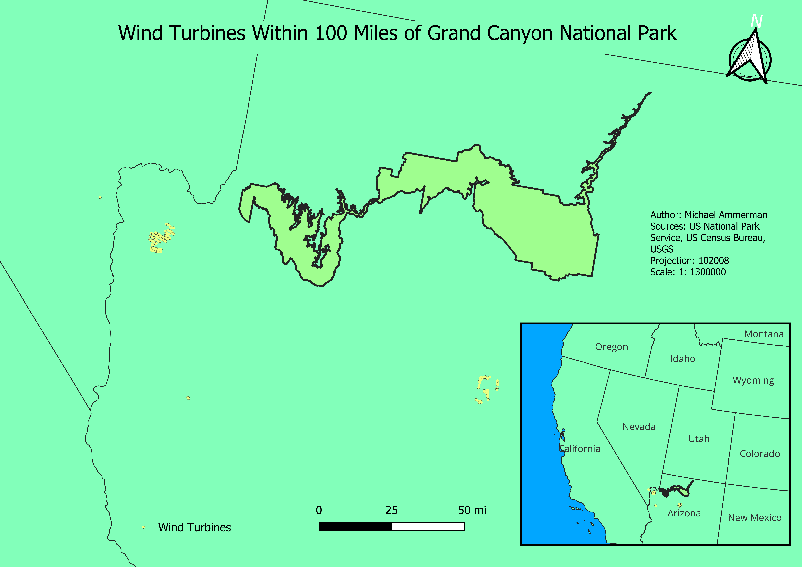

# Geoprocessing summary

## Mapping question:
How many Windturbines are within 100 miles of Grand Canyon National Park outter boundaries?

## Data utilized:
USGS Wind turbines - https://eerscmap.usgs.gov/uswtdb/
State boundaries - US Census Bureau - https://www.census.gov/geographies/mapping-files/time-series/geo/carto-boundary-file.html
Grand Canyon Boundary - US National Parks Service - https://public-nps.opendata.arcgis.com/datasets/nps-boundary-1/explore?location=42.102470%2C-70.956425%2C5.77

## Result: 

## Mapping answer:
Provide a summary paragraph that identifies how your result answers the mapping question. What's the takeaway message from your analysis? Please include that here.